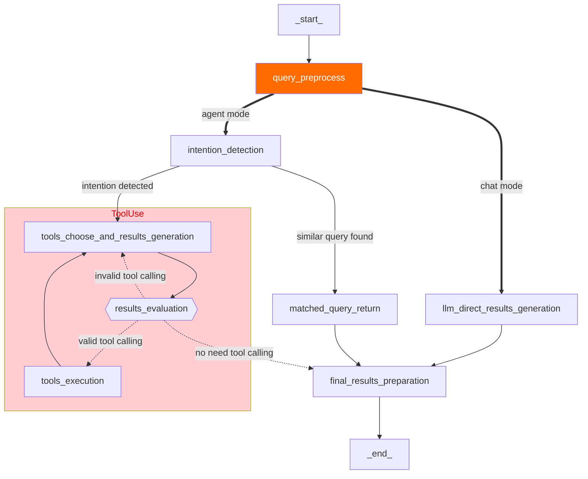

English | [简体中文](README_zh-cn.md)


<h1 align="center">
  Chatbot Portal with Agent
</h1>
<h4 align="center">Chatbot Portal with Agent: Streamlined Workflow for Building Agent-Based Applications</h4>
<div align="center">
  <h4>
    <a href="https://github.com/aws-samples/Intelli-Agent/commits/main/stargazers"></a>
    <a href="https://github.com/aws-samples/Intelli-Agent/actions/workflows/pull-request-lint.yml"></a>
    <a href="https://opensource.org/license/apache-2-0"></a>
  </h4>
</div>

Chatbot Portal with Agent offers a streamlined workflow for developing scalable, production-grade agent-based applications, such as conversational chatbots. Key features include:

1. **Enterprise Knowledge Base Creation**: Users can upload private documents in various formats (PDF, DOCX, HTML, CSV, TXT, MD, JSON, JSONL, PNG, JPG, JPEG, WEBP) to construct a personalized knowledge base.

2. **Flexible Mode Options**: Choose from multiple modes (Agent, Chat, RAG) to suit diverse requirements. For instance, the Agent model can interpret user intent, select appropriate tools, and act on iterative results.

3. **Configurable Chat-Based UI**: Our React/Next.js chat interface is user-friendly, making it easy to configure, explore, and customize to meet your specific needs.

4. **Comprehensive RESTful API**: Our full-featured API facilitates easy integration with existing applications, enhancing functionality and user experience.

Chatbot Portal with Agent is designed to empower developers to rapidly deploy intelligent, context-aware applications with minimal overhead and maximum efficiency.

## Table of Contents
- [Architecture](#architecture)
- [Quick Start](#quick-start)
- [API Reference](#api-reference)
- [FAQ](#FAQ)
- [Contribution](#Contribution)
- [License](#license)

## Architecture
Deploying this solution using the default parameters will build the following environment in Amazon Web Services:


The execution process is as follows:

1. The solution's front-end website is hosted in an Amazon S3 bucket and distributed via Amazon CloudFront. Authentication is provided by an Amazon Cognito user pool.
2. When users upload documents to the knowledge base through the solution's website, the documents are first uploaded to the Amazon S3 bucket.
3. An Amazon Lambda function is then triggered, which in turn triggers an Amazon Step Functions workflow to process the file. Within Amazon Step Functions, the document is parsed and segmented using an Amazon Glue Job, with intermediate states stored in Amazon DynamoDB and Amazon S3.
4. The Amazon Glue Job vectorizes the segmented text blocks using an Embedding model deployed in an Amazon SageMaker Endpoint and injects them into the vector database Amazon OpenSearch. If the document is in image format (e.g., png, webp) or a pdf with images, the Amazon Glue Job uses Amazon Bedrock to interpret the images and convert them to text. Finally, Amazon SNS sends the execution result to the user via email.
5. When users send chat messages through the solution's website, the online module's Amazon API Gateway is triggered. Front-end and back-end communication is achieved via WebSocket API. An Amazon Lambda function integrated with Amazon API Gateway sends the request message to Amazon SQS to prevent message timeout.
6. Messages in Amazon SQS are consumed by the online module's Amazon Lambda, which executes Agent/RAG/Chat logic based on the request parameters and records the chat messages in Amazon DynamoDB. The Amazon Lambda function uses intent recognition to determine the necessary tools and perform the corresponding operations.
7. If the RAG model is selected, the Amazon Lambda function vectorizes the query message using the Embedding model deployed in the Amazon SageMaker Endpoint, retrieves matching knowledge from Amazon OpenSearch, reorders the results, and sends the knowledge to the large language model, which then returns the answer to the front end.
8. During the chat, messages between the user and AI are stored in Amazon DynamoDB. The solution's website retrieves a specific chat record through Amazon API Gateway and Amazon Lambda, allowing the user to continue the conversation based on the content of that chat record.

### Enterprise Knowledge Base Construction
Its data preprocessing module includes format recognition, content extraction, metadata conversion, and semantic segmentation, seamlessly in the background.


When a large number of content injection requests are received, it can automatically scale out by running multiple Amazon Glue jobs concurrently, ensuring these requests are processed in time.

#### Chunk Metadata
Chunk metadata is defined as below shown:
| Name | Description |
| - | - |
|file_path| S3 path to store the file |
|file_type| File type, eg. pdf, html |
|content_type| paragraph: paragraph content |
|current_heading| The heading which the chunk belongs to |
|chunk_id| Unique chunk id |
|heading_hierarchy| Heading hierarchy which is used to locate the chunk in the whole file content |
|title| The heading of current section|
|level| Heading level, eg. H1 is #, H2 is ## in markdown |
|parent| The chunk id of parent section, eg. H2's parent is its H1, H3's parent is its H2 |
|previous| The chunk id of previous paragraph at the same Level |
|child| The chunk ids of sub sections |
|next|The chunk id of next paragraph at the same Level |
|size| The number of the chunks when the paragraph is split by a fixed chunk size |

Here is an example

```
{
	"file_path": "s3://example/intelli-agent-user-guide.pdf",
	"file_type": "pdf",
	"content_type": "paragragh",
	"current_heading": "# Intelli-Agent User Guide WebApp",
	"chunk_id": "$1-4659f607-1",
	"heading_hierarchy": {
		"title": "Intelli-Agent User Guide",
		"level": 1,
		"parent": null,
		"previous": null,
		"child": [
			"$2-038759db",
			"$4-68d6e6ca",
			"$6-e9cdcf68"
		],
		"next": null,
		"size": 2
	}
}

```

### Flexible Mode Options

The whole online logic is implemented using [LangGraph](https://langchain-ai.github.io/langgraph/). The first node is **query_preprocess_lambda** which 
handles the chat history. Then the user can choose from two modes: 
chat and agent. The **chat** mode lets you interact directly 
with different LLMs, such as Anthropic Claude 3. 
The **agent** mode is the most 
complex mode which gives you the possibility to handle complex business 
scenarios. Given the most relevant intention from **intention_detection_lambda** 
and chat history from **query_preprocess_lambda**, **agent_lambda** 
will decide which tools to use and whether the information is enough 
to answer the query. The **parse_tool_calling** node will parse the 
output of **agent_lambda**: 

* **agent_lambda** chooses the wrong tool 
from the perspective of tool format, it will be 
forced to think again through **invalid_tool_calling** edge. 
* **agent_lambda** chooses the valid tool, the tool will be executed 
through **tool_exectue_lambda**. Then, **agent_lambda** will decide 
whether the running results are enough to answer the query.
* There are some cases that **agent_lambda** decides to give the final
response. For cases needing RAG, the **rag_retrieve_lambda** and 
**rag_llm_lambda** will be called. For cases that **agent_lambda** 
needs more information, the **give_rhetorical_question** node will 
be executed. For cases where a constant reply needs to be given, the 
**transfer_reply** and **comfort_reply** will be executed. The 
**give_final_response** means the current results of tool calling 
is enough to answer the query.



## Quick Start

[](https://aws-gcr-solutions.s3.cn-north-1.amazonaws.com.cn/intelli-agent/videos/intelli-agent-deployment.mp4 "Intelli-Agent Deployment")

Follow these steps to get started:

1. [Prerequisites](#prerequisites)
2. [Deployment](#Deployment)

### Prerequisites

**Step 1**: Install the required dependencies

Execute following commands to install dependencies such as Python, Git, npm, docker and create a service linked role for Amazon OpenSearch service. You can skip this step if they are already installed.
The `setup_env.sh` script is adapted for Amazon Linux 2023. If you are using other operating systems, please manually install these dependencies.


```bash
wget https://raw.githubusercontent.com/aws-samples/Intelli-Agent/dev/source/script/setup_env.sh
sh setup_env.sh
```

**Step 2**: Install the AWS CLI 

Execute the following command to install the AWS CLI if it is not installed.

```bash
curl "https://awscli.amazonaws.com/awscli-exe-linux-x86_64.zip" -o "awscliv2.zip"
unzip awscliv2.zip
sudo ./aws/install
```

You can execute the following command to check the AWS CLI version:

```bash
aws --version
```

### Deployment

To deploy the solution, follow these steps:

**Step 1**: Clone the GitHub repository

```bash
git clone git@github.com:aws-samples/Intelli-Agent.git
```

**Step 2**: Navigate to the `source/infrastructure` directory

```bash
cd Intelli-Agent/source/infrastructure
```

**Step 3**: Install the project dependencies

```bash
npm install
```

**Step 4**: Run the configuration command to set up the solution with the desired features:

```bash
npm run config
```

You will be prompted to enter the following information:

- **Prefix**: A prefix for the solution stack name. This prefix will be added to all resources created by the solution.
- **SubEmail**: The email address to receive notifications.
- **KnowledgeBase**: Enable or disable the knowledge base feature.
- **KnowledgeBaseType**: Select the type of knowledge base to enable.
- **Chat**: Enable or disable the chat feature.
- **Connect**: Enable or disable the integration with Amazon Connect, it can answer the question from Amazon Connect.
- **Model**: Select the model to use for the solution.
- **UI**: Enable or disable the UI feature.

After entering the information, the configuration file `config.json` will be generated in the `source/infrastructure/bin` directory. You can rerun the `npm run config` command or modify this file to customize the solution configuration.

**Step 5**: Prepare the required deployment resources, including the frontend and model assets

```bash
npm run build
```

**Step 6**: (Optional) Bootstrap AWS CDK on the target account and region

If this is the first time your account is using CDK to deploy resources, please refer to [this document](https://docs.aws.amazon.com/cdk/v2/guide/bootstrapping-env.html) for CDK bootstrap.

```bash
npx cdk bootstrap aws://<Your AWS account ID>/<AWS region>
```

**Step 7**: Deploy the solution

```bash
npx cdk deploy
```

**Step 8**: Confirm the deployment

After deployment, you can find a stack containing `intelli-agent` in the CloudFormation console. On the Output tab of the stack, you can find key solution information, commonly explained as follows:

| Name | Description |
| - | - |
| WebPortalURL | Link to the Intelli-Agent frontend website. |
| APIEndpointAddress | RESTful API endpoint address primarily used for data preprocessing, chat history, etc. |
| WebSocketEndpointAddress | WebSocket API endpoint address primarily used for chat functionality. |


### Updating an Existing Deployment

You can update an existing deployment following these steps:

**Step 1**: Navigate to the `source/infrastructure` directory

```bash
cd Intelli-Agent/source/infrastructure
```

**Step 2**: Adjust the configuration

Rerun the `npm run config` command, or modify the config.json located under the `source/infrastructure/bin` directory.

Sample config.json:

```json
{
  "prefix": "",
  "email": "your-email@amazon.com",
  "deployRegion": "us-east-1",
  "knowledgeBase": {
    "enabled": false,
    "knowledgeBaseType": {
      "intelliAgentKb": {
        "enabled": true,
        "email": "support@example.com",
        "vectorStore": {
          "opensearch": {
            "enabled": true,
            "useCustomDomain": false,
            "customDomainEndpoint": ""
          }
        },
        "knowledgeBaseModel": {
          "enabled": true,
          "ecrRepository": "intelli-agent-knowledge-base",
          "ecrImageTag": "latest"
        }
      }
    }
  },
  "chat": {
    "enabled": true,
    "bedrockRegion": "us-east-1",
    "useOpenSourceLLM": true,
    "amazonConnect": {
      "enabled": true
    }
  },
  "model": {
    "embeddingsModels": [
      {
        "provider": "sagemaker",
        "name": "bce-embedding-and-bge-reranker",
        "commitId": "43972580a35ceacacd31b95b9f430f695d07dde9",
        "dimensions": 1024,
        "default": true
      }
    ],
    "llms": [
      {
        "provider": "bedrock",
        "name": "anthropic.claude-3-sonnet-20240229-v1:0"
      }
    ],
    "modelConfig": {
      "modelAssetsBucket": "intelli-agent-models-078604973627-us-west-2"
    }
  },
  "ui": {
    "enabled": true
  },
  "federatedAuth": {
    "enabled": true,
    "provider": {
      "cognito": {
        "enabled": true
      },
      "authing": {
        "enabled": false
      }
    }
  }
}
```

**Step 3**: (Optional) If you wish to create new sagemaker models, or update frontend assets, run the following command:

```bash
npm run build
```

**Step 4**: Execute the following command to update the deployment:

```bash
aws ecr-public get-login-password --region us-east-1 | docker login --username AWS --password-stdin public.ecr.aws
npx cdk deploy
```

### Uninstalling the Solution

To uninstall the solution, follow these steps:

1. Log in to the AWS Management Console and navigate to the CloudFormation page.
2. Select the stack that contains the keyword `intelli-agent`.
3. Click on the Delete button to initiate the deletion process.


## Feature Overview


### 1. Large Language Model Switching
Currently supports the following LLMs:
- Claude3 Haiku
- Claude3 Sonnet
- Claude3.5 Sonnet

### 2. Chat Window
The chat area consists of two main functionalities: Chatbot and History.
The Chatbot can initiate a new conversation based on supported LLM models.
History -> The chat history ID that needs to be restarted will display past chat records on the page. Users can continue their conversation based on it.


### 3. Document Library (Knowledge Base)
The Document Library (required for RAG) currently supports document creation (one upload at a time) and deletion (multiple deletions at a time).
- Supports 12 document formats: pdf, docx, txt, csv, jsonl, json, html, md, png, jpg, jpeg, webp
- UI upload document size limit: 10MB

Tips:
- If users repeatedly upload the same document name, the backend will overwrite it with the latest document.
- Create Document -> After selecting the file and clicking upload, the backend operation is divided into two parts: document upload and offline processing. Only when both are completed will the status bar display "Completed".
- Example:


### 4. User Management
The current username is displayed in the upper right corner. Click "Logout" to log out.

### 5. Interface Display Language Switching
Currently supports Simplified Chinese and English.


## API Reference
After CDK deployment, you can use a HTTP client such as Postman/cURL to invoke the API by following below API schema. 
- [LLM API Schema](https://github.com/aws-samples/Intelli-Agent/blob/main/docs/LLM_API_SCHEMA.md): send question to LLM and get a response.
- [ETL API Schema](https://github.com/aws-samples/Intelli-Agent/blob/main/docs/ETL_API_SCHEMA.md): upload knowledge to the vector database.
- [AOS API Schema](https://github.com/aws-samples/Intelli-Agent/blob/main/docs/AOS_API_SCHEMA.md): search data in the vector database.


## FAQ

### Current Model Selection for Each Processing Stage
The current models used in each stage are as follows, selected based on internal team testing and current effectiveness. Customers can customize and replace these models. Detailed model replacement is available.

| Function | Model |
| - | - |
| Rerank | BGE-reranker-large |
| Embedding | BCE |
| LLM | Claude3/Claude3.5 |

### How to Get Support
Get support by creating an issue on GitHub.

### After Deployment, How to Get Initial Username and Password
During CDK deployment, you specified the SubEmail parameter, which is the email address used for receiving notifications. After a successful CDK deployment, the initial username and password will be sent to this email.

### How Documents are Split
Documents of various types are first converted to Markdown format and then split based on paragraphs. If the split paragraphs exceed the maximum token limit (default is 500, customizable in glue-job-script.py), they are split again. The split text blocks and metadata are recorded in an S3 bucket and injected into the vector database after vectorization.

To inject intent data into your system, follow these steps:

### Step-by-Step Guide to Inject Intent Data

1. **Obtain JWT Token:**
   - Refer to the documentation at [docs/auth.md](docs/auth.md) to understand how to obtain a JWT token.
   - Use Postman or a similar tool for this process.

2. **Injection Using ETL API:**
   - Use the schema specified in [docs/ETL_API_SCHEMA.md](docs/ETL_API_SCHEMA.md) for intent data injection.
   - Below is a sample JSON structure that you can use to inject intent data. Replace the placeholders with your specific S3 bucket and file details:

   ```json
   {
       "s3Bucket": "your-bucket-name",
       "s3Prefix": "s3path/default-intent.jsonl",
       "offline": "true",
       "qaEnhance": "false",
       "workspaceId": "default-intent",
       "operationType": "create",
       "documentLanguage": "zh",
       "indexType": "qq"
   }
   ```

3. **Data Injection Format:**
   - Use the following JSON format for injecting individual intent data:

   ```json
   {"question": "Hello", "answer": {"intent": "chat"}}
   ```

   - Replace `"Hello"` with the actual question text.


### How to Update Resources Used by ETL

The current solution is undergoing continuous updates, requiring manual updates for the document parsing component.

1. [Optional] Update Document Parsing Model Endpoint

```bash
# Input a new ETL tag when executing sh build.sh
cd source/script
sh build.sh -b <S3 bucket name> -i <ETL model name> -t <new ETL tag name> -r <AWS region>

# Input a new ETL tag when executing cdk deploy to trigger ETL endpoint update
npx cdk deploy --rollback true --parameters S3ModelAssets=<Your S3 Bucket Name> --parameters SubEmail=<Your email address> --parameters EtlImageName=<Your ETL model name> --parameters ETLTag=<Your new ETL tag name> --require-approval never
```

2. Manually Update ETL Dependencies' whl Package


First, confirm the path corresponding to `--extra-py-files` in your ETL Job.


Next, upload `source/lambda/job/dep/dist/llm_bot_dep-0.1.0-py3-none-any.whl` to the location where Glue dependencies are stored.

```bash
aws s3 cp source/lambda/job/dep/dist/llm_bot_dep-0.1.0-py3-none-any.whl s3://<Your Glue job bucket>/llm_bot_dep-0.1.0-py3-none-any.whl
```


## Testing
For detailed test information, please refer to the [Test Doc](https://github.com/aws-samples/Intelli-Agent/blob/dev/tests/README.md)

## Contribution
See [CONTRIBUTING](CONTRIBUTING.md#security-issue-notifications) for more information.

## License
This project is licensed under the Apache-2.0 License.
