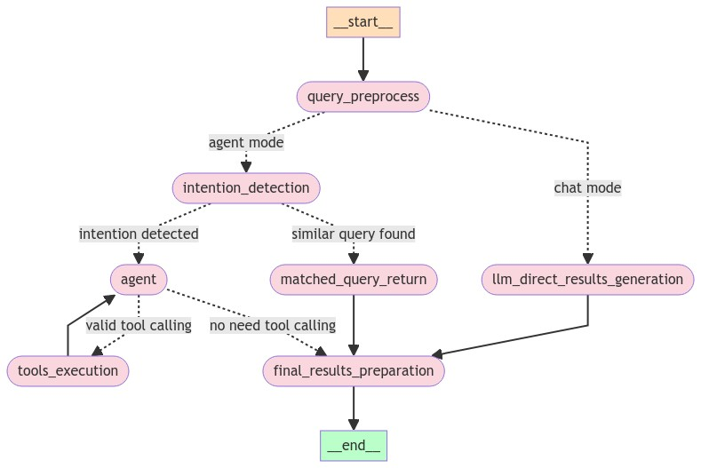

<h1 align="center">
  Intelli-Agent
</h1>
<h4 align="center">Intelli-Agent: Streamlined Workflow for Building Agent-Based Applications</h4>
<div align="center">
  <h4>
    <a href="https://github.com/aws-samples/Intelli-Agent/commits/main/stargazers"></a>
    <a href="https://github.com/aws-samples/Intelli-Agent/actions/workflows/pull-request-lint.yml"></a>
    <a href="https://opensource.org/license/apache-2-0"></a>
  </h4>
</div>

Intelli-Agent offers a streamlined workflow for developing scalable, production-grade agent-based applications, such as conversational chatbots. Key features include:

1. **Enterprise Knowledge Base Creation**: Users can upload private documents in various formats (PDF, DOCX, HTML, CSV, TXT, MD, JSON, JSONL, PNG, JPG, JPEG, WEBP) to construct a personalized knowledge base.

2. **Flexible Modes Options**: Choose from multiple modes (Agent, Chat, RAG) to suit diverse requirements. For instance, the Agent model can interpret user intent, select appropriate tools, and act on iterative results.

3. **Configurable Chat-Based UI**: Our React/Next.js chat interface is user-friendly, making it easy to configure, explore, and customize to meet your specific needs.

4. **Comprehensive RESTful API**: Our full-featured API facilitates easy integration with existing applications, enhancing functionality and user experience.

Intelli-Agent is designed to empower developers to rapidly deploy intelligent, context-aware applications with minimal overhead and maximum efficiency.

## Table of Contents
- [Architecture](#architecture)
- [ETL Workflow](#etl-workflow)
- [Quick Start](#quick-start)
- [Deployment Parameters](#deployment-parameters)
- [API Reference](#api-reference)
- [Optional Steps](#optional-steps)
- [Other Samples](#other-samples)
- [Security](#security)
- [License](#license)

## Architecture
Deploying this solution using the default parameters will build the following environment in Amazon Web Services:


The execution process is as follows:

1. The solution's front-end website is hosted in an Amazon S3 bucket and distributed via Amazon CloudFront. Authentication is provided by an Amazon Cognito user pool.
2. When users upload documents to the knowledge base through the solution's website, the documents are first uploaded to the Amazon S3 bucket.
3. An Amazon Lambda function is then triggered, which in turn triggers an Amazon Step Functions workflow to process the file. Within Amazon Step Functions, the document is parsed and segmented using an Amazon Glue Job, with intermediate states stored in Amazon DynamoDB and Amazon S3.
4. The Amazon Glue Job vectorizes the segmented text blocks using an Embedding model deployed in an Amazon SageMaker Endpoint and injects them into the vector database Amazon OpenSearch. If the document is in image format (e.g., png, webp) or a pdf with images, the Amazon Glue Job uses Amazon BedRock to interpret the images and convert them to text. Finally, Amazon SNS sends the execution result to the user via email.
5. When users send chat messages through the solution's website, the online module's Amazon API Gateway is triggered. Front-end and back-end communication is achieved via WebSocket API. An Amazon Lambda function integrated with Amazon API Gateway sends the request message to Amazon SQS to prevent message timeout.
6. Messages in Amazon SQS are consumed by the online module's Amazon Lambda, which executes Agent/RAG/Chat logic based on the request parameters and records the chat messages in Amazon DynamoDB. The Amazon Lambda function uses intent recognition to determine the necessary tools and perform the corresponding operations.
7. If the RAG model is selected, the Amazon Lambda function vectorizes the query message using the Embedding model deployed in the Amazon SageMaker Endpoint, retrieves matching knowledge from Amazon OpenSearch, reorders the results, and sends the knowledge to the large language model, which then returns the answer to the front end.
8. During the chat, messages between the user and AI are stored in Amazon DynamoDB. The solution's website retrieves a specific chat record through Amazon API Gateway and Amazon Lambda, allowing the user to continue the conversation based on the content of that chat record.

### Enterprise Knowledge Base Creation
Its data preprocessing module includes format recognition, content extraction, metadata conversion, and semantic segmentation, seamlessly in the background.


When a large number of content injection requests are received, it can automatically scale out by running multiple Amazon Glue jobs concurrently, ensuring these requests are processed in time.

#### Chunk Metadata
Chunk metadata is defined as below shown:
| Name | Description |
| - | - |
|file_path| S3 path to store the file |
|file_type| File type, eg. pdf, html |
|content_type| paragraph: paragraph content |
|current_heading| The heading which the chunk belongs to |
|chunk_id| Unique chunk id |
|heading_hierarchy| Heading hierarchy which is used to locate the chunk in the whole file content |
|title| The heading of current section|
|level| Heading level, eg. H1 is #, H2 is ## in markdown |
|parent| The chunk id of parent section, eg. H2's parent is its H1, H3's parent is its H2 |
|previous| The chunk id of previous paragraph at the same Level |
|child| The chunk ids of sub sections |
|next|The chunk id of next paragraph at the same Level |
|size| The number of the chunks when the paragraph is splitted by a fixed chunk size |

Here is an example

```
{
	"file_path": "s3://example/intelli-agent-user-guide.pdf",
	"file_type": "pdf",
	"content_type": "paragragh",
	"current_heading": "# Intelli-Agent User Guide WebApp",
	"chunk_id": "$1-4659f607-1",
	"heading_hierarchy": {
		"title": "Intelli-Agent User Guide",
		"level": 1,
		"parent": null,
		"previous": null,
		"child": [
			"$2-038759db",
			"$4-68d6e6ca",
			"$6-e9cdcf68"
		],
		"next": null,
		"size": 2
	}
}

```


### Flexible Modes Options

The following graph is generated by online logic which is built 
based on [langgraph](https://langchain-ai.github.io/langgraph/). As
you can see, the first node is **query_preprocess_lambda** which 
handles the chat history. Then user can choose from thress modes: 
chat, rag and agent. The **chat** mode let you interact directly 
with different LLM, like anthropic claude 3, chat gpt and so on. 
The **rag** mode will retrieve the relevant contents relating to the
current query and let LLM answer it. The **agent** mode is the most 
complex mode which gives you possibility to handle complex business 
scenarios. Given most relevant intention from **intention_detection_lambda** 
and chat history from **query_preprocess_lambda**, **agent_lambda** 
will decide which tools to use and whether the information is enough 
to answer the query. The **parse_tool_calling** node will parse the 
output of **agent_lambda**: 

* **agent_lambda** chooses the wrong tool 
from the perspective of tool format, it will be 
forced to think again through **invalid_tool_calling** edge. 
* **agent_lambda** chooses the valid tool, the tool will be executed 
through **tool_exectue_lambda**. Then, **agent_lambda** will decide 
whether the running results is enough to answer the query.
* There are some cases that **agent_lambda** desicde to give the final
response. For cases needing RAG, the **rag_retrieve_lambda** and 
**rag_llm_lambda** will be called. For cases that **agent_lambda** 
needs more information, the **give_rhetorical_question** node will 
be executed. For cases that constant reply needs to be given, the 
**transfer_reply** and **comfort_reply** will be executed. The 
**give_final_response** means the current results of tool calling 
is enough to answer the query.



## Quick Start
Follow these steps to get started:

1. [Prerequisites](#prerequisites)
2. [Prepare Model Assets](#prepare-model-assets)
3. [Deploy CDK Template](#deploy-cdk-template)
4. [API Reference](#api-reference)

### Prerequisites
First, you need to clone the repository. You can do this by executing the following command:
```bash
git clone <this repo>
```

Then, you need to install the following prerequisites:
```bash
cd source/infrastructure
npm install
```

### Prepare Model Assets
Execute the script per model folder. Make sure Python is installed properly.

First, navigate to the model directory and run the prepare_model.sh script. This script requires an S3 bucket name as an argument, which will be used to upload the model. Please make sure the bucket name is located in the same region as the CDK deployment.

```bash
cd source/model/
./prepare_model.sh -s <Your S3 Bucket Name>
```

Next, navigate to the ETL code directory. Depending on your region, you will use either the Dockerfile or DockerfileCN. The model.sh script requires the Dockerfile, ETL image name, AWS region, and ETL image tag as arguments. The ETL image will be pushed to your ECR repo with the image name you specified.

```bash
cd source/model/etl/code
sh model.sh ./Dockerfile <EtlImageName> <AWS_REGION> <EtlImageTag>
```

For example, to prepare ETL model asset in the us-east-1 region, the command is:

```bash
sh model.sh ./Dockerfile intelli-agent-etl us-east-1 latest
```

Finally, if this is the first time using Amazon OpenSearch in this account, you will need to create a service-linked role for Amazon OpenSearch Service. This role is necessary to allow Amazon OpenSearch Service to manage resources on your behalf.

```bash
aws iam create-service-linked-role --aws-service-name es.amazonaws.com
```
### Build Frontend

```bash
cd source/portal
npm install && npm run build
```

### Deploy CDK Template
Please make sure **docker** is installed and the CDK command is executed in the **same region** of the model files which are uploaded in previous step. 

Login to AWS ECR Public to pull the image from the public repository.
```
cd source
aws ecr-public get-login-password --region us-east-1 | docker login --username AWS --password-stdin public.ecr.aws
```

Start the deployment by executing the following command:
```bash
cd source/infrastructure
npx cdk deploy --parameters S3ModelAssets=<Your S3 Bucket Name> --parameters SubEmail=<Your email address> --parameters EtlImageName=<Your ETL model name> --parameters ETLTag=<Your ETL tag name>
```

To deploy the offline process only, you can configure context parameters to skip the online process. 

```bash
npx cdk deploy --parameters S3ModelAssets=<Your S3 Bucket Name> --parameters SubEmail=<Your email address> --parameters EtlImageName=<Your ETL model name> --parameters ETLTag=<Your ETL tag name> --context DeploymentMode="OFFLINE_EXTRACT"
```

## Deployment Parameters
| Parameter | Description |
|-|-|
| S3ModelAssets | Your bucket name to store models |
| SubEmail | Your email address to receive notifications |
| OpenSearchIndex | OpenSearch index name to store the knowledge, if the index is not existed, the solution will create one |
| EtlImageName | ETL image name, eg. etl-model, it is set when you executing source/model/etl/code/model.sh script |
| EtlTag | ETL tag, eg. latest, v1.0, v2.0, the default value is latest, it is set when you executing source/model/etl/code/model.sh script |


### Optional Context Parameters

| Context | Description |
|---------|-------------|
| DeploymentMode | The mode for deployment. There are three modes: `OFFLINE_EXTRACT`, `OFFLINE_OPENSEARCH`, and `ALL`. Default deployment mode is `ALL`. |


## API Reference
After CDK deployment, you can use a HTTP client such as Postman/cURL to invoke the API by following below API schema. 
- [LLM API Schema](https://github.com/aws-samples/llm-bot/tree/main/docs/LLM_API_SCHEMA.md): send question to LLM and get a response.
- [ETL API Schema](https://github.com/aws-samples/llm-bot/tree/main/docs/ETL_API_SCHEMA.md): upload knowledge to vector database.
- [AOS API Schema](https://github.com/aws-samples/llm-bot/tree/main/docs/AOS_API_SCHEMA.md): search data in the vector database.


## Test
For detailed test information, please refer to the [Test Doc](https://github.com/aws-samples/llm-bot/tree/dev/tests/README.md)

## Optional Steps
- [Upload Embedding File](#upload-embedding-file)

### Upload Embedding File
Upload the embedding file to the S3 bucket created in the previous step. This object created event will trigger the Step function to execute Glue job for online processing.

```bash
aws s3 cp <Your documents> s3://llm-bot-documents-<Your account id>-<region>/<Your S3 bucket prefix>/
```

## Other Samples
Try the [Bedrock tutorial](https://github.com/aws-samples/llm-bot/blob/main/sample/bedrock-tuturial.ipynb) to quickly get through the bedrock model & langchain.

## Contribution
See [CONTRIBUTING](CONTRIBUTING.md#security-issue-notifications) for more information.

## License
This project is licensed under the Apache-2.0 License.