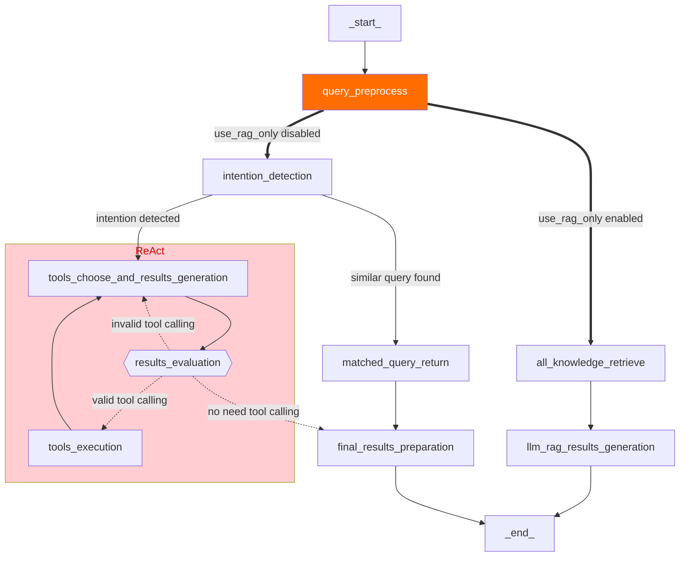

[English](README.md) | 简体中文

<h1 align="center">
  Intelli-Agent
</h1>
<h4 align="center">Intelli-Agent：构建基于代理的应用程序的优化工作流</h4>
<div align="center">
  <h4>
    <a href="https://github.com/aws-samples/Intelli-Agent/commits/main/stargazers"></a>
    <a href="https://github.com/aws-samples/Intelli-Agent/actions/workflows/pull-request-lint.yml"></a>
    <a href="https://opensource.org/license/apache-2-0"></a>
  </h4>
</div>

Intelli-Agent 提供一个高效简洁的工作流程，用于开发可扩展的、生产级别的、基于 agent（代理）的应用。例如：智能对话机器人等

主要功能包括：

1. **企业知识库创建**：用户可以上传各种格式的私有文档（PDF、DOCX、HTML、CSV、TXT、MD、JSON、JSONL、PNG、JPG、JPEG、WEBP）来构建个性化的知识库。

2. **可配置的基于聊天的用户界面**：提供用户友好的聊天界面，便于配置、探索和自定义，以满足您的特定需求。

3. **全面的API**：我们功能齐全的 API 便于与现有应用程序集成，增强功能和用户体验。

Intelli-Agent 旨在以最小的开销和最大的效率帮助开发人员快速部署智能、上下文感知的应用程序。

## 目录
- [架构](#架构)
- [快速开始](#快速开始)
- [API 调用](#API调用)
- [FAQ](#FAQ)
- [贡献](#贡献)
- [License](#license)

## 架构

使用默认参数部署此解决方案将在 Amazon Web Services 中构建以下环境：


执行过程如下：

1. 解决方案的前端网站托管在Amazon S3桶中，通过Amazon CloudFront分发。Amazon Cognito用户池为其提供身份验证。
2. 用户通过方案网站上传文档到知识库时，文档会首先上传到Amazon S3桶。
3. Amazon Lambda随即被触发，并触发Amazon Step Functions处理文件。Amazon Step Functions中通过Amazon Glue Job对文档进行解析和切分，并将中间状态分别存储到Amazon DynamoDB和Amazon S3。
4. Amazon Glue Job将切分后的文本块通过部署在Amazon SageMaker Endpoint中的Embedding模型进行向量化，并注入到向量数据库Amazon OpenSearch。其中，如果文档是图片格式（如：png，webp）或pdf格式，Amazon Glue Job会通过Amazon Bedrock理解图片并转换成文本。最后Amazon SNS会将执行结果以邮件的方式通知到用户。具体文档处理细节，请参考章节8.2.
5. 当用户在方案网站发送聊天信息时，在线模块的Amazon API Gateway会被触发，前后端通信是通过WebSocket API实现。Amazon API Gateway集成的Amazon Lambda函数将请求消息发送到Amazon SQS防止消息超时。
6. Amazon SQS中的消息会被在线模块的Amazon Lambda消费，根据请求参数执行Agent/RAG/Chat逻辑，并将聊天信息记录到Amazon DynamoDB。Amazon Lambda通过意图识别判断需要使用的工具，并进行相应操作。
7. 如果选择RAG模型，Amazon Lambda通过Amazon SageMaker Endpoint中部署的Embedding模型将查询消息进行向量化，在Amazon OpenSearch中查询到匹配的知识（目前默认返回top 5知识，如需调整，请参考章节8.3），对其进行倒排，然后将知识发送给大语言模型，最后将答案返回给前端。
8. 在聊天时，用户和AI的消息会存储在Amazon DynamoDB中，方案网站通过Amazon API Gateway和Amazon Lambda获取到某次聊天记录，用户可以基于这次聊天记录的内容继续进行聊天。


### 企业知识库创建
数据预处理模块包括格式识别、内容提取、元数据转换和语义分割，无缝地在后台进行。


当系统收到大量内容注入请求时，它可以通过同时运行多个 Amazon Glue 任务来自动扩展，确保这些请求及时处理。


#### 文本块元数据

文本块元数据定义如下：

| 名称              | 描述                                                   |
| ----------------- | ------------------------------------------------------ |
| file_path         | 存储文件的 S3 路径                                     |
| file_type         | 文件类型，例如 pdf、html                               |
| content_type      | 段落：段落内容                                         |
| current_heading   | 该块所属的标题                                         |
| chunk_id          | 唯一的文本块 ID                                        |
| heading_hierarchy | 用于定位整个文件内容中该块的标题层次                   |
| title             | 当前部分的标题                                         |
| level             | 标题级别，例如 在 Markdown 中，H1 是 #，H2 是 ##       |
| parent            | 父部分的块 ID，例如 H2 的父部分是 H1，H3 的父部分是 H2 |
| previous          | 同一级别上前一段落的块 ID                              |
| child             | 子部分的文本块 ID                                      |
| next              | 同一级别上下一段落的块 ID                              |
| size              | 段落按固定大小拆分后的文本块数量                       |

示例：

```
{
	"file_path": "s3://example/intelli-agent-user-guide.pdf",
	"file_type": "pdf",
	"content_type": "paragragh",
	"current_heading": "# Intelli-Agent User Guide WebApp",
	"chunk_id": "$1-4659f607-1",
	"heading_hierarchy": {
		"title": "Intelli-Agent User Guide",
		"level": 1,
		"parent": null,
		"previous": null,
		"child": [
			"$2-038759db",
			"$4-68d6e6ca",
			"$6-e9cdcf68"
		],
		"next": null,
		"size": 2
	}
}

```


### 灵活的模式选项

下图是基于 [LangGraph](https://langchain-ai.github.io/langgraph/) 生成的在线逻辑。第一个节点是 **query_preprocess_lambda**，它处理聊天历史记录。用户在会话页面开启或关闭**只使用RAG**开关：**开启只使用RAG** 将检索与当前查询相关的内容并让 LLM 回答。**关闭只使用RAG** 会根据 **intention_detection_lambda** 提供的最相关意图和 **query_preprocess_lambda** 提供的聊天历史记录，**agent_lambda** 将决定使用哪些工具以及这些信息是否足以回答查询。**parse_tool_calling** 节点将解析 **agent_lambda** 的输出：

* 如果 **agent_lambda** 从工具格式的角度选择了错误的工具，那么会通过 **invalid_tool_calling** 进行重新思考。
* 如果 **agent_lambda** 选择了有效工具，那么会通过 **tool_execute_lambda** 执行该工具。然后，**agent_lambda** 将决定运行结果是否足以回答查询。
* 在某些情况下，**agent_lambda** 决定给出最终回应。对于需要 RAG 的情况，将调用 **rag_retrieve_lambda** 和 **rag_llm_lambda**。对于 **agent_lambda** 需要更多信息的情况，将执行 **give_rhetorical_question** 进行反问。对于需要给出固定回复的情况，将执行 **transfer_reply** 和 **comfort_reply**。**give_final_response** 意味着工具调用的当前结果足以回答查询。




## 快速开始

部署视频：

[](https://aws-gcr-solutions.s3.cn-north-1.amazonaws.com.cn/intelli-agent/videos/intelli-agent-deployment.mp4 "Intelli-Agent Deployment")

参考[部署链接](https://amzn-chn.feishu.cn/docx/JSakd9VCBoHrzfx9Gvoctm60nyg?from=from_copylink)


## API调用
在 CDK 部署后，您可以使用 HTTP client，例如 Postman/cURL 来调取 API.
- [llm api schema](docs/llm_api_schema.md): send question to llm and get a response.
- [ETL API Schema](docs/ETL_API_SCHEMA.md): upload knowledge to the vector database.
- [AOS API Schema](docs/AOS_API_SCHEMA.md): search data in the vector database.


## FAQ

### 如何获取支持
通过在 GitHub 上创建 Issue 获取支持。

### 部署后，如何获取初始用户名和密码
在CDK部署时您指定了SubEmail参数，它是用于接受邮件通知的邮箱地址，当CDK部署成功后，初始用户名和密码会发送到此邮箱。

### 如何切分文档
各种类型的文档首先会转换成Markdown格式，然后根据段落进行切分，如果切分后的段落超过最大token（默认值500，用户可以在glue-job-script.py中自定义），则进行二次切分，切分后的文本块和元数据会记录在S3桶中，在向量化后最终注入向量数据库。


## 测试
参考[测试文档](https://github.com/aws-samples/Intelli-Agent/blob/dev/tests/README.md)获取更多测试信息。

## 成本
参考[成本文档](COST_zh-cn.md)获取更多信息。

## 贡献
参考[贡献文档](CONTRIBUTING.md#security-issue-notifications)获取更多信息。

## License
此项目采用 Apache-2.0 License。
